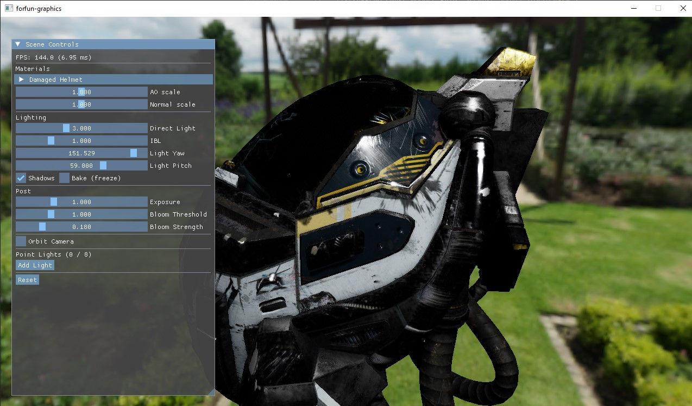

# forfun-graphics

A from-scratch **Vulkan 1.3 PBR renderer** with a Filament-style material system. Built as a learning project exploring modern GPU-driven rendering techniques — physical materials, image-based lighting, shadow mapping, HDR post-processing, and a material authoring pipeline.



---

## Features

### Rendering

| Feature | Detail |
|---------|--------|
| **Cook-Torrance BRDF** | GGX normal distribution, Smith geometry term, Schlick Fresnel |
| **Image-based lighting** | HDR equirectangular → cubemap bake; split-sum specular IBL (prefiltered env + BRDF LUT); SH-projected diffuse irradiance |
| **Shadow mapping** | 2048×2048 directional shadow map, depth-only pre-pass, slope-scaled depth bias, 3×3 PCF filtering |
| **Bloom** | Bright-pass extract → separable 5-tap Gaussian (ping-pong HDR targets) → additive composite |
| **Tone mapping** | ACES (Narkowicz approximation) on HDR R16G16B16A16 scene buffer → sRGB swapchain |
| **Normal mapping** | Tangent-space normals; tangent frame derived analytically from screen-space derivatives (no TANGENT attribute required) |
| **Skybox** | Fullscreen triangle, world direction reconstructed via `invViewProj` |
| **Point lights** | Up to 8 dynamic point lights with position, color, range, and intensity, editable at runtime |
| **Screen-space refraction** | Prior-frame scene capture copied to texture; refraction materials distort UVs via IOR and thickness |

### Material System

Inspired by Filament. Materials are authored in a declarative `.mat` text format and compiled offline to binary `.fpkg` packages by **forfun_matc**, the bundled material compiler. The renderer hot-reloads `.fpkg` files when the corresponding `.mat` source changes on disk.

**Supported shading models:**

| Model | Use case |
|-------|----------|
| `lit` | Standard PBR — metallic-roughness, transmission/refraction |
| `unlit` | Flat shading with emissive support |
| `cloth` | Ashikhmin cloth BRDF with sheen and subsurface color |
| `subsurface` | Wrap-lighting subsurface scattering approximation |
| `specularGlossiness` | Legacy KHR_materials_pbrSpecularGlossiness workflow |

**Blend modes:** `opaque`, `transparent`, `masked`, `add`

**Pipeline variants** are compiled lazily per (shading model × blend mode × depth-only) combination and cached.

### Tooling

- **forfun_matc** — offline material compiler: parses `.mat` → generates GLSL → invokes `glslangValidator` → packages SPIR-V + metadata into a `.fpkg` binary
- **material_package_test** — round-trip serialisation test for `.fpkg` files
- **CMake auto-compilation** — `damaged_helmet.fpkg` is built as a `add_custom_command` dependency of the main executable; a fresh clone runs without manual `forfun_matc` invocations

---

## Platforms

| Platform | Status | Notes |
|----------|--------|-------|
| **Windows** | Tested | MSVC 2022; primary development platform |
| **Linux** | Expected | GCC 12+ or Clang 15+; same CMake/Vulkan SDK flow |
| **macOS** | Untested | Requires MoltenVK (bundled with the Vulkan SDK); some Vulkan 1.3 extensions may have gaps |

---

## Prerequisites

| Requirement | Version | Notes |
|-------------|---------|-------|
| **Vulkan SDK** | 1.3.275+ | From [vulkan.lunarg.com](https://vulkan.lunarg.com/). Provides headers, loader, validation layers, and `glslangValidator`. |
| **CMake** | 3.22+ | |
| **C++20 compiler** | MSVC 2022 / Clang 15+ / GCC 12+ | |
| **Internet access** | — | Required on first configure; CPM fetches all dependencies automatically. |

---

## Build

```bash
git clone https://github.com/borosbence2/forfun-graphics.git
cd forfun-graphics

cmake -B build -DCMAKE_BUILD_TYPE=Release   # or Debug
cmake --build build --parallel
```

On first configure CMake will:
1. Fetch all dependencies via CPM (GLFW, vk-bootstrap, VMA, glm, tinygltf, Dear ImGui)
2. Download `DamagedHelmet.glb` from the Khronos glTF sample repository
3. Download `symmetrical_garden_02_1k.hdr` from PolyHaven (CC0)
4. Compile GLSL shaders to SPIR-V C headers via `glslangValidator`
5. Compile `damaged_helmet.fpkg` via `forfun_matc`

The executable is `build/forfun_graphics` (Linux/macOS) or `build/Debug/forfun_graphics.exe` (Windows).

---

## Controls

| Input | Action |
|-------|--------|
| **Left-drag** | Orbit camera |
| **ImGui panel** | Tune material parameters, lighting, bloom, exposure, point lights |

The ImGui "Scene Controls" panel exposes:
- Per-material parameter sliders (introspected at runtime from the `.fpkg` metadata)
- Direct light direction (yaw/pitch), intensity
- IBL strength, AO scale, normal scale
- Bloom threshold and strength
- Exposure
- Shadow toggle
- Point light editor (add/remove, position, color, range, intensity)
- Orbit camera toggle and reset

---

## Project Structure

```
forfun-graphics/
├── CMakeLists.txt              # Build, dependency fetch, shader/material compilation
├── cmake/
│   ├── CPM.cmake               # Dependency manager bootstrap
│   └── config.h.in             # Asset paths baked in at configure time
├── src/
│   ├── main.cpp                # App entry point: device init, render loop, ImGui, teardown
│   ├── types.h                 # Shared structs (Vertex, UBO, push constants, constants)
│   ├── vk_helpers.{h,cpp}      # Buffer/Texture/Cubemap/RenderTarget wrappers + upload helpers
│   ├── gltf_loader.{h,cpp}     # glTF 2.0 mesh + texture loader (tinygltf)
│   ├── ibl.{h,cpp}             # IBL bake: env cubemap, prefiltered env, BRDF LUT, SH projection
│   ├── pipelines.{h,cpp}       # Fixed pipeline factories: skybox, fullscreen post
│   ├── material.{h,cpp}        # Material: per-package pipeline cache, layout, descriptor set
│   ├── material_instance.{h,cpp} # MaterialInstance: per-draw parameters + samplers
│   ├── material_package.{h,cpp}  # .fpkg binary format: load/save, parameter metadata
│   ├── vma_impl.cpp            # VulkanMemoryAllocator single-TU implementation
│   └── tinygltf_impl.cpp       # tinygltf + stb_image single-TU implementation
├── shaders/
│   ├── post.vert               # Fullscreen triangle (shared by all post passes)
│   ├── bloom_extract.frag      # Bright-pass threshold
│   ├── bloom_blur.frag         # Separable 5-tap Gaussian; direction via push constant
│   ├── post_composite.frag     # ACES tone map + bloom add → swapchain
│   ├── skybox.vert / .frag     # Cubemap skybox
│   ├── equirect_to_cube.comp   # Bakes HDR equirect → 6-face cubemap
│   ├── prefilter_env.comp      # Importance-sampled GGX prefilter (per mip level)
│   ├── brdf_lut.comp           # Split-sum BRDF LUT bake
│   └── sh_project.comp         # SH coefficient projection for diffuse irradiance
├── materials/                  # .mat source files; .fpkg binaries are gitignored
│   ├── damaged_helmet.mat      # Lit PBR — base color, metallic-roughness, normal map
│   ├── unlit_test.mat          # Unlit + emissive
│   ├── refraction_test.mat     # Lit + transmission/IOR (screen-space refraction)
│   ├── cloth_test.mat          # Cloth BRDF with subsurface color
│   ├── sheen_test.mat          # Cloth sheen (WIP)
│   ├── subsurface_test.mat     # Subsurface scattering approximation
│   ├── anisotropy_test.mat     # Anisotropic specular (WIP)
│   ├── clearcoat_test.mat      # Two-lobe clearcoat (WIP)
│   └── specgloss_test.mat      # Specular-glossiness workflow (WIP)
├── tools/
│   ├── matc/                   # Material compiler (forfun_matc)
│   │   ├── main.cpp            # CLI entry: parse args, call compiler, write .fpkg
│   │   ├── mat_parser.{h,cpp}  # .mat text format parser
│   │   ├── mat_description.h   # Parsed in-memory AST
│   │   ├── codegen.{h,cpp}     # GLSL code generator (full vert + frag per variant)
│   │   └── spirv_compiler.{h,cpp} # glslangValidator subprocess wrapper → SPIR-V bytes
│   └── material_package_test.cpp  # Round-trip serialisation smoke test
├── assets/                     # Downloaded by CMake at configure time (gitignored)
│   ├── DamagedHelmet/DamagedHelmet.glb
│   └── env/environment.hdr
└── docs/
    ├── STACK.md                # Technology choices and rationale
    ├── M8_MATERIALS_PLAN.md    # Material system design notes
    └── M8_PLAN.md              # Broader roadmap
```

---

## Material Authoring

Materials are written in a declarative DSL (`.mat` files) and compiled to binary `.fpkg` packages.

### Anatomy of a `.mat` file

```
material {
    name         : MyMaterial,
    shadingModel : lit,           // lit | unlit | cloth | subsurface | specularGlossiness
    blendMode    : opaque,        // opaque | transparent | masked | add
    requires     : [ POSITION, NORMAL, UV0 ],

    parameters : [
        { type : float4, name : baseColorFactor, default : float4(1, 1, 1, 1) },
        { type : float,  name : roughnessFactor, default : 0.5 }
    ],
    samplers : [
        { type : sampler2d_srgb, name : baseColorMap },
        { type : sampler2d,      name : normalMap    }
    ]
}

fragment {
    void material(inout MaterialInputs m) {
        m.baseColor = texture(baseColorMap, getUV0()) * baseColorFactor;
        m.roughness = roughnessFactor;
        m.normal    = texture(normalMap, getUV0()).xyz * 2.0 - 1.0;
    }
}
```

**`MaterialInputs` fields available in `fragment {}`:**

| Field | Type | Models |
|-------|------|--------|
| `baseColor` | `vec4` | all |
| `roughness` | `float` | lit, cloth, subsurface |
| `metallic` | `float` | lit |
| `normal` | `vec3` | all (tangent-space) |
| `ao` | `float` | lit |
| `emissive` | `vec3` | all |
| `transmission` | `float` | lit |
| `ior` | `float` | lit |
| `thickness` | `float` | lit, subsurface |
| `sheenColor` | `vec3` | cloth |
| `subsurfaceColor` | `vec3` | cloth, subsurface |
| `subsurfacePower` | `float` | subsurface |

**Intrinsic helper functions available in `fragment {}`:**

| Function | Returns |
|----------|---------|
| `getUV0()` | `vec2` — interpolated UV channel 0 |
| `getWorldPosition()` | `vec3` — fragment world-space position |
| `getWorldNormal()` | `vec3` — interpolated geometric normal (world space) |

### Compiling a material manually

```bash
# After building:
./build/forfun_matc  materials/my_material.mat  -o materials/my_material.fpkg
```

CMake can be configured to auto-compile additional materials by adding a block to `CMakeLists.txt` following the `helmet_fpkg` pattern:

```cmake
set(MY_MAT_PATH  "${CMAKE_SOURCE_DIR}/materials/my_material.mat")
set(MY_FPKG_PATH "${CMAKE_SOURCE_DIR}/materials/my_material.fpkg")
add_custom_command(
    OUTPUT  ${MY_FPKG_PATH}
    COMMAND $<TARGET_FILE:forfun_matc> ${MY_MAT_PATH} -o ${MY_FPKG_PATH}
    DEPENDS forfun_matc ${MY_MAT_PATH}
    VERBATIM
)
add_custom_target(my_fpkg DEPENDS ${MY_FPKG_PATH})
add_dependencies(forfun_graphics my_fpkg)
```

### Hot reload

While the renderer is running, saving a `.mat` file triggers automatic recompilation and pipeline reload without restarting the application. The renderer polls `std::filesystem::last_write_time` each frame.

---

## Architecture Notes

### Descriptor set layout

| Set | Binding | Content |
|-----|---------|---------|
| 0 | 0 | Frame UBO (`viewProj`, `invViewProj`, `lightViewProj`, `cameraPos`) |
| 0 | 1 | Lighting UBO (light dir/intensity, IBL params, surface scales) |
| 0 | 2 | Prefiltered env cubemap |
| 0 | 3 | BRDF LUT |
| 0 | 4 | Shadow map |
| 0 | 5 | SH coefficients buffer |
| 0 | 6 | Scene capture (prior frame, for screen-space refraction) |
| 0 | 7 | Point lights UBO |
| 1 | 0..N | Per-material parameter UBO + samplers (layout generated by `forfun_matc`) |

### Push constants

Each draw call uploads a 64-byte `mat4` model matrix via push constants (vertex stage). This is the zero-allocation path for per-object transforms, within Vulkan's guaranteed 128-byte minimum push constant budget.

### Vulkan 1.3 patterns

- **Dynamic rendering** (`VK_KHR_dynamic_rendering`, core in 1.3) — no render pass or framebuffer objects anywhere
- **Synchronization2** (`VK_KHR_synchronization2`, core in 1.3) — `VkImageMemoryBarrier2` and `vkQueueSubmit2` throughout
- **Timeline semaphores** — feature enabled; binary semaphores + `VkFence` used for swapchain sync
- **Descriptor indexing** — feature flags enabled for future bindless work
- **Buffer device address** — enabled on the allocator; reserved for GPU-driven rendering

---

## Dependencies

All fetched automatically by CPM at configure time — no manual installs beyond the Vulkan SDK.

| Library | Version | Purpose |
|---------|---------|---------|
| **vk-bootstrap** | v1.3.302 | Instance, physical device, device, and swapchain boilerplate |
| **VulkanMemoryAllocator** | v3.1.0 | Buffer and image suballocation |
| **GLFW** | 3.4 | Window creation and input |
| **glm** | 1.0.1 | Math (vectors, matrices, transforms) |
| **tinygltf** | v2.9.5 | glTF 2.0 mesh and texture loading |
| **Dear ImGui** | v1.90.9 | Runtime parameter editing UI (GLFW + Vulkan backends) |
| **stb_image** | (via tinygltf) | LDR and HDR image loading |

---

## Roadmap

See [docs/STACK.md](docs/STACK.md) and [docs/M8_PLAN.md](docs/M8_PLAN.md) for the full milestone breakdown. Planned next steps:

- Multi-mesh scene with heterogeneous materials
- Temporal Anti-Aliasing (TAA)
- Ground Truth Ambient Occlusion (GTAO)
- Screen-space reflections (SSR)
- Hardware ray tracing: RT shadows, RT reflections, RT GI

---

## Assets

- **DamagedHelmet.glb** — Khronos Group glTF sample model, used under Creative Commons Attribution 4.0
- **symmetrical_garden_02_1k.hdr** — PolyHaven, CC0
